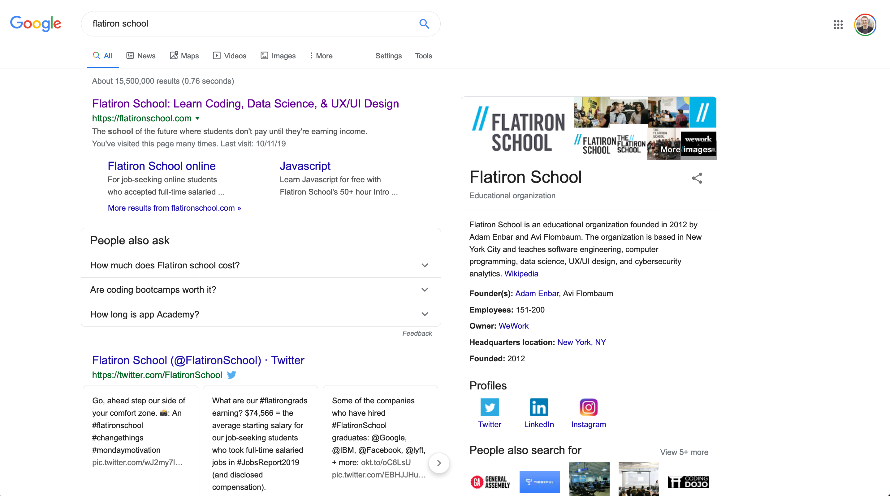

## Google Search Results

Your task is to use React components to recreate this:

The final HTML and CSS is loaded into the `App.js` and `App.css` already. Your task is to:

* Break both of those up into appropriately-sized components
* Replace all of the hard-coded data with data from the `state` that's been loaded into the App component

Some notes:

* Your solution does not need to be adaptive or responsive
* Some properties need to be interpreted. For example, most dates will need to be put in the correct format. A package such as `dayjs` or `date-fns` is recommended.
